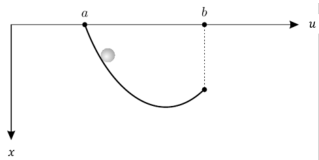

tags:: Calculus of Variations

- ## Example: Rolling a Ball Down a Ramp
- {:height 219, :width 382}
- **Goal**: build a ramp such that the ball can arrive at point $b$ in the shortest time possible.
- Let the speed of the ball at $u$ is $s(u)$, and let $x(u)$ denote the shape of the ramp. By conservation of energy we find that
  
  $$ \frac{1}{2} m s(u)^2 = mgx(u) \Rightarrow s(u) = \sqrt{2gx(u)}$$
  
  Then the total time is
  
  $$ J[x] = \int_a^b \frac{\sqrt{1 + x^{\prime}(u)^2}}{\sqrt{2g x(u)}}\mathrm{d} u. $$
-
-
-